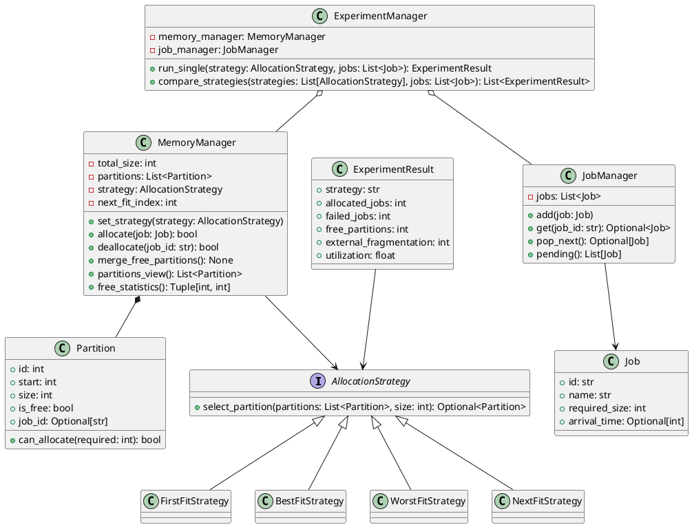

# Dynamic Partition Allocation Simulation System Design

## 1. Overview
This document describes the design for a console-based dynamic partition memory allocation simulator. The implementation language is **Python 3**, chosen for rapid prototyping, readability, and ease of extension. The simulator models contiguous physical memory, supports multiple allocation strategies (First Fit, Best Fit, Worst Fit, Next Fit), and provides experiment tooling to compare algorithm behavior under the same workload.

## 2. Functional Modules
```
+---------------------------+
|        Console UI         |
|  - Menus / commands       |
+-------------+-------------+
              |
              v
+-------------+-------------+
|      ExperimentManager    |
|  - Runs workloads         |
|  - Collects statistics    |
+------+--------------------+
       | uses
+------+--------------------+
|      MemoryManager        |<-----------+
|  - Partition list         |            |
|  - Allocation/deallocation|            |
+------+--------------------+            |
       | composes                        |
+------+--------------------+            |
|      Partition (model)    |            |
+---------------------------+            |
                                           depends on
+---------------------------+            |
|      AllocationStrategy   |<-----------+
|  - select_partition()     |
+---------------------------+
| FirstFit | BestFit | WorstFit | NextFit|
+----------------------------------------+

+---------------------------+
|        JobManager         |
|  - Job queue CRUD         |
+---------------------------+
|          Job              |
+---------------------------+
```
* **Console UI** gathers user input, invokes experiment runs, and prints partition states.
* **ExperimentManager** coordinates jobs, memory manager, and statistics collection.
* **MemoryManager** owns the ordered partition list and delegates block selection to an **AllocationStrategy** implementation.
* **JobManager** stores pending jobs and provides retrieval utilities.
* **Models** include `Job`, `Partition`, `ExperimentResult`.

## 3. Class Design
### PlantUML Class Diagram


### Public Method Semantics
- **AllocationStrategy.select_partition(partitions, size)** → returns a suitable free `Partition` or `None` based on the strategy.
- **MemoryManager.set_strategy(strategy)** → swaps allocation strategy; resets Next Fit cursor when appropriate.
- **MemoryManager.allocate(job)** → attempts allocation; splits free partition if larger than the job size; returns `True` on success, `False` on failure with reason printed.
- **MemoryManager.deallocate(job_id)** → frees the partition owned by `job_id`, merges adjacent free blocks, returns `True` when a partition was freed.
- **MemoryManager.merge_free_partitions()** → consolidates adjacent free partitions sorted by start address.
- **MemoryManager.partitions_view()** → returns a shallow copy for display/reporting.
- **MemoryManager.free_statistics()** → computes external fragmentation (sum of all free partitions) and count of free partitions.
- **JobManager.add(job)** → appends a job if ID is unique; raises `ValueError` on duplicates.
- **JobManager.get(job_id)** → retrieves a job by ID.
- **JobManager.pop_next()** → FIFO retrieval from the queue.
- **ExperimentManager.run_single(strategy, jobs)** → deep-copies the job list, resets memory, runs each job allocation, and captures statistics.
- **ExperimentManager.compare_strategies(strategies, jobs)** → runs multiple strategies over identical job workloads and returns aggregated results.

## 4. Database Design (Documentation Only)
Even though the current implementation uses in-memory structures, the design anticipates persistence. The ER model covers jobs, experiments, optional memory snapshots, and partition states.

### ER Diagram (textual)
```
[JOB] 1---* [PARTITION_STATE] *---1 [MEMORY_SNAPSHOT] *---1 [EXPERIMENT]
```
- **EXPERIMENT** records a simulation run (strategy, parameters, description).
- **MEMORY_SNAPSHOT** captures partition states at checkpoints within an experiment.
- **PARTITION_STATE** stores start, size, free flag, and referencing `JOB` when allocated.
- **JOB** holds job metadata and can be linked from partition snapshots.

### Table Definitions
```sql
CREATE TABLE JOB (
    JobID        VARCHAR(20) PRIMARY KEY,
    Name         VARCHAR(50) NOT NULL,
    RequiredSize INT NOT NULL CHECK (RequiredSize > 0),
    ArrivalTime  INT
);

CREATE TABLE EXPERIMENT (
    ExpID           INTEGER PRIMARY KEY AUTOINCREMENT,
    Name            VARCHAR(50) NOT NULL,
    StrategyType    VARCHAR(20) NOT NULL,
    TotalMemorySize INT NOT NULL CHECK (TotalMemorySize > 0),
    RunTime         DATETIME,
    Description     TEXT
);

CREATE TABLE MEMORY_SNAPSHOT (
    SnapshotID  INTEGER PRIMARY KEY AUTOINCREMENT,
    ExpID       INT NOT NULL,
    TimePoint   INT,
    Description TEXT,
    FOREIGN KEY (ExpID) REFERENCES EXPERIMENT(ExpID)
);

CREATE TABLE PARTITION_STATE (
    PartitionStateID INTEGER PRIMARY KEY AUTOINCREMENT,
    SnapshotID       INT NOT NULL,
    StartAddress     INT NOT NULL,
    Size             INT NOT NULL,
    IsFree           BOOLEAN NOT NULL,
    JobID            VARCHAR(20),
    FOREIGN KEY (SnapshotID) REFERENCES MEMORY_SNAPSHOT(SnapshotID),
    FOREIGN KEY (JobID) REFERENCES JOB(JobID)
);
```

### Data Dictionary (selected fields)
- **JOB.JobID**: unique identifier; `VARCHAR(20)`; PK; NOT NULL.
- **JOB.RequiredSize**: memory request size in KB; `INT`; CHECK > 0; NOT NULL.
- **EXPERIMENT.StrategyType**: algorithm label; `VARCHAR(20)`; values like `FirstFit`, `BestFit`, `WorstFit`, `NextFit`.
- **MEMORY_SNAPSHOT.TimePoint**: logical time or step index; `INT`; nullable.
- **PARTITION_STATE.IsFree**: boolean flag for partition availability; NOT NULL.

## 5. Program Logic Diagrams
### Main System Activity
```
Start
  |
Initialize memory (default or user input)
  |
Load/create job queue
  |
Select allocation algorithm or comparison mode
  |
+-------------------------------+
| For each job in workload:     |
|   attempt allocation          |
|   on failure -> report reason |
+-------------------------------+
  |
Optional deallocation by user
  |
Compute statistics (utilization, fragmentation)
  |
Display final partitions and results
  |
Restart with another algorithm? (Y/N)
  |
 End
```

### Allocate Memory Sequence
```
UI -> ExperimentManager: allocate(job)
ExperimentManager -> MemoryManager: allocate(job)
MemoryManager -> AllocationStrategy: select_partition(free_list, size)
AllocationStrategy --> MemoryManager: partition | None
MemoryManager: split/update partition, mark allocated
MemoryManager --> ExperimentManager: success/failure
ExperimentManager --> UI: display result
```

### Deallocate & Merge Flowchart
```
Receive job_id
  |
Locate partition with job_id
  |
[found?]--No-->Report missing job
  |
 Yes
  |
Mark partition as free
  |
merge_free_partitions()
  |
Display updated partition list
```
`merge_free_partitions()` sorts by `start`, merges consecutive free blocks, and deletes absorbed partitions.

## 6. Statistics and Metrics
For each experiment run the system reports:
- **External fragmentation**: sum of sizes of all free partitions.
- **Free partitions count**: number of free blocks after allocations.
- **Utilization**: total allocated size divided by total memory.

## 7. Usage Overview
- Configure memory size (default 512 KB with a single free block).
- Add jobs via menu or load sample workload.
- Choose an allocation algorithm (First Fit / Best Fit / Worst Fit / Next Fit).
- Allocate and deallocate interactively, or run comparison across algorithms to see statistics side-by-side.

