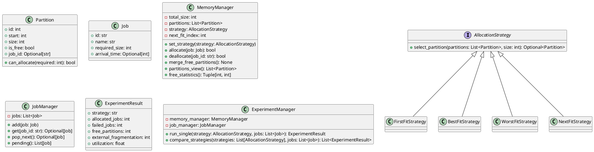

# 动态分区分配仿真系统设计

## 1. 概述
本文档描述基于 **Python 3** 的控制台动态分区内存分配模拟器设计。系统模拟连续物理内存，支持首次适应、最佳适应、最坏适应与循环首次适应等策略，并提供在相同作业负载下比较各算法表现的实验工具。

## 2. 功能模块
```
+---------------------------+
|        Console UI         |
|  - 菜单/命令输入          |
+-------------+-------------+
              |
              v
+-------------+-------------+
|      ExperimentManager    |
|  - 运行负载               |
|  - 收集统计               |
+------+--------------------+
       | uses
+------+--------------------+
|      MemoryManager        |<-----------+
|  - 分区列表               |            |
|  - 分配/回收              |            |
+------+--------------------+            |
       | composes                        |
+------+--------------------+            |
|      Partition (model)    |            |
+---------------------------+            |
                                           depends on
+---------------------------+            |
|      AllocationStrategy   |<-----------+
|  - select_partition()     |
+---------------------------+
| FirstFit | BestFit | WorstFit | NextFit|
+----------------------------------------+

+---------------------------+
|        JobManager         |
|  - 作业队列 CRUD          |
+---------------------------+
|          Job              |
+---------------------------+
```
* **Console UI**：收集用户输入，触发实验运行并打印分区状态。
* **ExperimentManager**：协调作业、内存管理器与统计收集。
* **MemoryManager**：维护有序分区列表，将选块逻辑交给具体分配策略。
* **JobManager**：存储待处理作业并提供检索工具。
* **模型**：`Job`、`Partition`、`ExperimentResult`。

## 3. 类设计
### PlantUML 类图


### 关键类说明
- **Partition**：表示一段连续内存，记录起始地址、大小、是否空闲以及所绑定作业 ID；`can_allocate` 判断是否可满足请求。
- **Job**：作业或进程定义，包含 ID、名称、需求大小与可选到达时间。
- **AllocationStrategy**：策略接口，`select_partition` 负责从空闲分区列表中选择可用块；具体实现有首次/最佳/最坏/循环首次适应。
- **MemoryManager**：管理分区列表与策略；提供分配、回收、排序、合并与统计接口。
- **JobManager**：维护待分配作业队列及基本 CRUD。
- **ExperimentManager**：封装单策略运行与多策略对比，输出 `ExperimentResult`。

## 4. 数据库设计（文档级）
尽管当前实现未持久化，仍设计可扩展的数据库方案。

### 4.1 ER 图
```
JOB (JobID, Name, RequiredSize, ArrivalTime)
EXPERIMENT (ExpID, Name, StrategyType, TotalMemorySize, RunTime, Description)
MEMORY_SNAPSHOT (SnapshotID, ExpID, TimePoint, Description)
PARTITION_STATE (PartitionStateID, SnapshotID, StartAddress, Size, IsFree, JobID)
```
- 一个 EXPERIMENT 拥有多个 MEMORY_SNAPSHOT；
- 一个 MEMORY_SNAPSHOT 拥有多个 PARTITION_STATE；
- PARTITION_STATE 可引用 JOB。

### 4.2 表结构示例
```sql
CREATE TABLE JOB (
    JobID        VARCHAR(20) PRIMARY KEY,
    Name         VARCHAR(50),
    RequiredSize INT NOT NULL,
    ArrivalTime  INT
);

CREATE TABLE EXPERIMENT (
    ExpID           INTEGER PRIMARY KEY AUTOINCREMENT,
    Name            VARCHAR(50),
    StrategyType    VARCHAR(20), -- FirstFit / BestFit / etc.
    TotalMemorySize INT NOT NULL,
    RunTime         DATETIME,
    Description     TEXT
);

CREATE TABLE MEMORY_SNAPSHOT (
    SnapshotID  INTEGER PRIMARY KEY AUTOINCREMENT,
    ExpID       INT NOT NULL,
    TimePoint   INT,
    Description TEXT,
    FOREIGN KEY (ExpID) REFERENCES EXPERIMENT(ExpID)
);

CREATE TABLE PARTITION_STATE (
    PartitionStateID INTEGER PRIMARY KEY AUTOINCREMENT,
    SnapshotID       INT NOT NULL,
    StartAddress     INT NOT NULL,
    Size             INT NOT NULL,
    IsFree           BOOLEAN NOT NULL,
    JobID            VARCHAR(20),
    FOREIGN KEY (SnapshotID) REFERENCES MEMORY_SNAPSHOT(SnapshotID),
    FOREIGN KEY (JobID) REFERENCES JOB(JobID)
);
```

### 4.3 数据字典要点
- `JobID`：作业唯一标识，VARCHAR(20)，主键，不可为空。
- `RequiredSize`：所需内存，INT，>0，非空。
- `StrategyType`：策略名称（FirstFit/BestFit/WorstFit/NextFit），VARCHAR(20)。
- `TotalMemorySize`：实验总内存容量，INT，>0，非空。
- `TimePoint`：快照时间点，INT，可空。
- `IsFree`：分区是否空闲，BOOLEAN，非空。

## 5. 主要流程与图示

### 5.1 系统主流程（活动图描述）
1. 启动系统，初始化或加载内存模型（默认整块空闲）。
2. 选择模式：实验/交互；选择分配算法。
3. 输入或加载作业队列。
4. 循环：
   - 取出下一个作业，调用 `MemoryManager.allocate`。
   - 分配失败则提示原因（无合适空闲块等）。
   - 分配成功更新分区列表，可保存快照。
5. 用户可按需回收作业，触发合并空闲分区。
6. 输出统计与最终分区状态，可选择再次实验或退出。

### 5.2 “分配内存”时序图
1. UI 调用 `ExperimentManager.allocateJob(jobId)`（示意）。
2. `ExperimentManager` 获取作业并调用 `MemoryManager.allocate`。
3. `MemoryManager` 收集空闲分区列表。
4. 调用策略 `select_partition` 选择适配块。
5. 若找到块则拆分/更新并标记为已分配，返回成功；否则返回失败。
6. UI 输出结果与最新分区状态。

### 5.3 “回收并合并空闲分区”流程
1. 接收作业 ID 或分区 ID。
2. 查找对应已分配分区并标记为空闲。
3. 调用 `merge_free_partitions`：
   - 按起始地址排序。
   - 遍历相邻分区，若连续两块均空闲则合并并累加大小。
4. 更新并展示当前分区列表。

## 6. 接口与方法说明
- `MemoryManager.allocate(job: Job) -> bool`：根据策略选择空闲块，必要时拆分分区；返回成功或失败。
- `MemoryManager.deallocate(job_id: str) -> bool`：释放指定作业分区并尝试合并，若未找到返回 False。
- `MemoryManager.free_statistics() -> Tuple[int, int]`：返回总空闲大小与空闲分区数量。
- `MemoryManager.utilization() -> float`：返回 (总容量-空闲)/总容量。
- `ExperimentManager.compare_strategies(strategies, jobs)`：复制同一批作业，分别在各策略下运行并输出对比结果。
- `ExperimentResult.as_row()`：格式化单条实验结果，用于表格输出。

## 7. 运行示例
- 通过 `python main.py --memory 512` 运行演示模式。
- 控制台模式可加载示例作业或手动输入，依次分配、回收并查看分区状态与指标。
